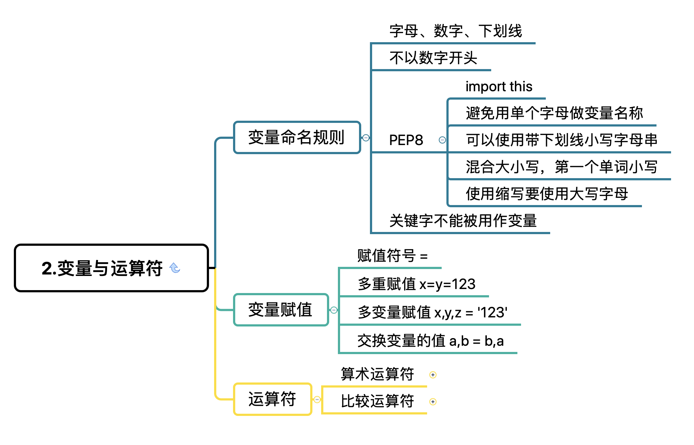

# Task 1

1. 环境搭建：anaconda环境配置、解释器
2. python初体验：print and input
3. python基础讲解：python变量特性+命名释方法、python中“：”作用、学会使用dir( )及和help( )、import使用、pep8介绍
4. python数值基本知识：python中数值类型（int，float，bool，e记法等）、算数运算符、逻辑运算符、成员运算符、身份运算符、运算符


## 环境搭建：anaconda环境配置、解释器

[如何使用Anaconda](https://shuiyujie.com/post/9d29b615.html)

解释器：python 是一种脚本语言，有两种执行方式：脚本文件执行和交互式执行。以脚本文件的方式执行指的是用解释器执行 `.py` 文件；交互式执行指的是在终端键入`python`，输入操作给你反馈。对比命令行操作，脚本文件执行的方式就像执行 shell script，交互式执行是在终端使用命令行。

[常用的 python 解释器](https://www.liaoxuefeng.com/wiki/1016959663602400/1016966024263840)

##python初体验：print and input 

```python
import random

number = random.randint(1, 100)
gauss_number = -1

while True:
    gauss_number = int(input("Please input number: "))
    if gauss_number < number:
        print("bigger")
    elif gauss_number > number:
        print("smaller")
    else:
        print("bingo")
        break
```

## python基础讲解



help() 用于查看帮助，dir() 查看模块中定义的名称

```
~ python # 进入交互界面
>>> help(dir()) # 查看 dir() 的帮助
>>> import math
>>> dir(math)
['__doc__', '__file__', '__loader__', '__name__', '__package__', '__spec__', 'acos', 'acosh', 'asin', 'asinh', 'atan', 'atan2', 'atanh', 'ceil', 'copysign', 'cos', 'cosh', 'degrees', 'e', 'erf', 'erfc', 'exp', 'expm1', 'fabs', 'factorial', 'floor', 'fmod', 'frexp', 'fsum', 'gamma', 'gcd', 'hypot', 'inf', 'isclose', 'isfinite', 'isinf', 'isnan', 'ldexp', 'lgamma', 'log', 'log10', 'log1p', 'log2', 'modf', 'nan', 'pi', 'pow', 'radians', 'sin', 'sinh', 'sqrt', 'tan', 'tanh', 'tau', 'trunc']
>>> math.__name__
'math'
>>> math.__doc__
'This module is always available.  It provides access to the\nmathematical functions defined by the C standard.'
>>> exit() # 退出
```

[PEP8风格指南](https://shuiyujie.com/post/6dde8c87.html)

## python数值基本知识

- `int()`：将一个数值或字符串转换成整数，可以指定进制。
- `float()`：将一个字符串转换成浮点数。
- `str()`：将指定的对象转换成字符串形式，可以指定编码。
- `chr()`：将整数转换成该编码对应的字符串（一个字符）。
- `ord()`：将字符串（一个字符）转换成对应的编码（整数）。

| 运算符                                                       | 描述                           |
| ------------------------------------------------------------ | ------------------------------ |
| `[]` `[:]`                                                   | 下标，切片                     |
| `**`                                                         | 指数                           |
| `~` `+` `-`                                                  | 按位取反, 正负号               |
| `*` `/` `%` `//`                                             | 乘，除，模，整除               |
| `+` `-`                                                      | 加，减                         |
| `>>` `<<`                                                    | 右移，左移                     |
| `&`                                                          | 按位与                         |
| `^` `\|`                                                     | 按位异或，按位或               |
| `<=` `<` `>` `>=`                                            | 小于等于，小于，大于，大于等于 |
| `==` `!=`                                                    | 等于，不等于                   |
| `is`  `is not`                                               | 身份运算符                     |
| `in` `not in`                                                | 成员运算符                     |
| `not` `or` `and`                                             | 逻辑运算符                     |
| `=` `+=` `-=` `*=` `/=` `%=` `//=` `**=` `&=` `\|=` `^=` `>>=` `<<=` | （复合）赋值运算符             |
