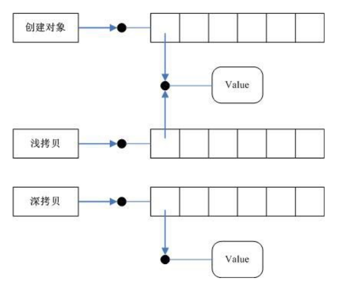

# 构造函数

```c++
class Dog
{
private:
    char name[50];
    int age;

public:
    
    Dog(char *dogName, int dogAge)
    {
        strcpy(name, dogName);
        age = dogAge;
    }

    void initDog(char *dogName, int dogAge)
    {
        strcpy(name, dogName);
        age = dogAge;
    }

    void bark()
    {
        std::cout << name << ": wang wang~~" << std::endl;
    }
};
```

初始化一个类，需要把参数传给一个类，比如说用 `void initDog(char *dogName, int dogAge)` 这个方法。C++ 给我提供了一种特殊的函数叫做构造函数就像 `Dog(char *dogName, int dogAge)` 这样。我们可以用 `Dog dog2("bbb", 5);` 的方式来调用构造函数并初始化类。

```c++
class 类名
{
    类名(参数列表)
    {
        构造体
    }
};
```

构造函数的格式，及注意事项：

1. 没有返回值
2. 方法名和类名一致
3. 构造函数可以重载，让参数列表不同
4. 默认存在无参构造函数，当自定义构造函数之后无参构造函数失效，此时需要手动定义

[构造函数代码示例](construct_function01.cpp)

# 析构函数

C++中的类可以定义一个特殊的成员函数清理对象,这个特殊的成员函数叫做析构函数。

```c++
class 类名
{
    ~类名(参数列表)
    {
        析构体
    }
};
```

析构函数格式，及注意事项:

1. 无返回值
2. 方法名和类名一致，前面有个 `~` 符号
3. 默认存在一个析构函数
4. 析构函数不可重载

```c++
class Dog
{
private:
    char *name;
    int age;

public:
    
    Dog(char *dogName, int dogAge)
    {
        std::cout << "调用了构造函数." << std::endl;

        name = new char[50];
        strcpy(name, dogName);
        age = dogAge;
    }

    void bark()
    {
        std::cout << name << ": wang wang~~" << std::endl;
    }

    ~Dog()
    {
        std::cout << "调用了析构函数." << std::endl;

        if(name != NULL)
        {
            delete name;
            name = NULL;
        }
    }
};
```

同样是 Dog 类，和文章开头的 Dog 类别比较有一点小的改动。private 类型变量 name，我将其由字符数组类型更改为了字符指针类型。新的 Dog 类就需要我们在使用的时候为 name 申明一块内存空间，就想我在其构造函数中所做的一样。

与之相对的就是在 Dog 类使用完成之后 free() 之前申明的内存空间。

[析构函数代码示例](construct_function02.cpp)

# 拷贝构造函数

在第一小节我们看到了普通的构造函数是怎么使用的，之前还提到了构造函数有无参构造函数和有参数构造函数。在没有显示申明构造函数的时候，类自带一个无参构造函数，而当我们显示申明构造函数之后，默认的无参构造函数就失效了，此时如果任然需要无参构造函数，那就需要我们自己显示申明。

接下来再介绍一种构造函数叫做拷贝构造函数，由一个以存在的类来初始化一个新的类就可以使用拷贝构造函数，此时将不由构造器来初始化，而是由拷贝构造器来初始化。

拷贝构造函数与构造函数、析构函数一样，也存在默认的拷贝构造函数，我们可以直接使用如下

```c++
Dog dog("bbb", 5);
dog.bark();

Dog dog2(dog);
dog2.bark();
```

如果想要自定一个拷贝构造函数格式如下

```c++
class 类名
{
    类名(const 类名 &dog)
    {
        拷贝构造体
    }
};
```

```c++
class Dog
{
private:
    char name[50];
    int age;

public:
    
    Dog(char *dogName, int dogAge)
    {
        std::cout << "调用了构造函数." << std::endl;

        strcpy(name, dogName);
        age = dogAge;
    }

    Dog(const Dog &dog)
    {

        std::cout << "调用了拷贝构造函数." << std::endl;
        
        strcpy(name, dog.name);
        age = dog.age;
    }

    void bark()
    {
        std::cout << name << ": wang wang~~" << std::endl;
    }
};
```

# 深拷贝和浅拷贝



与结构体一样，类也存在深拷贝和浅拷贝的问题。浅拷贝即拷贝之后两个变量共用一块内存空间，深拷贝即新建一块内存来保存被拷贝的信息。

浅拷贝不是真正意义上的拷贝。在结构体发生浅拷贝时，如果我们释放该结构体，将会影响其他引用该结构体的其他变量。在类中的浅拷贝，如果类中包含的数据元素全部在栈上,浅拷贝也可以满足需求的。但如果堆上的数据,则会发生多次析构行为。 

*注：关于结构体的深拷贝和浅拷贝可以看我这篇文章 [C语言学习笔记-结构体
](https://shuiyujie.com/post/e261fd69.html)。*

系统提供的默认拷贝构造器执行的就是浅拷贝操作，如果我们想要将其修改为深拷贝就需要自己手动来实现拷贝构造函数。

```c++
Dog(const Dog &dog)
{
    std::cout << "调用了拷贝构造函数." << std::endl;
    
    name = new char[50];        
    strcpy(name, dog.name);
    age = dog.age;
}
```