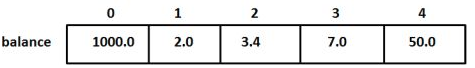
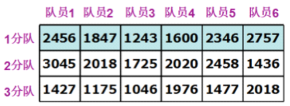

# 一维数组



Q: 什么是数组？

- 类型角度：数组是相同类型的变量的有序集合
- 存储角度：连续的存储空间

```c
#include <stdio.h>

int main()
{
    int a[] = {1, 2, 3, 4};

    // 计算数组大小
    int length_a = sizeof(a)/sizeof(a[0]);

    /* 使用数组下标，遍历一维数组 */
    for (int i = 0; i < length_a; i++)
    {
        printf("%d ", a[i]);
    }
    printf("\n");
    
    /* 使用指针，遍历一维数组 */
    for (int i = 0; i < length_a; i++)
    {
        printf("%d ", *(a+i));
    }
    printf("\n");

    return 0;
}
```

# 二维数组



二维数组在**逻辑上**可以想象成上图所示的按照行列排列的方阵。实际**存储上**二维数组和一维数组一样，也是存储在一篇连续的存储空间上的。

```c
#include <stdio.h>

int main()
{

    /* 二维数组初始化 */

    // 规整的二维数组
    int a[3][4] = {
        {1, 2, 3, 4},
        {5, 6, 7, 8},
        {9, 10, 11, 12},
    };

    // 一般会将其写成一维数组的形式
    int a1[3][4] = {1, 2, 3, 4, 5, 6, 7, 8, 9, 10, 11, 12};

    // 行数可以省略，根据总数和列数可以推断行数
    int a2[][4] = {1, 2, 3, 4, 5, 6, 7, 8, 9, 10, 11, 12};

    /* 二维数组遍历 */

    // 二维数组的遍历
    int i = 0;
    int j = 0;
    int n = sizeof(a) / sizeof(a[0]);
    int nj = sizeof(a[0]) / sizeof(a[0][0]);
    for(i = 0; i < n; i++)
    {
        for(j = 0; j < nj; j++)
        {
            printf("%d ", a[i][j]);
        }
        printf("\n");
    }

    /* 二维数组，数组名代表的含义 */
    printf("a: %d, a+1: %d\n", a, a+1);
    // a: -421310000, a+1: -421309984 - 相差 16，4 个 int
    printf("%d, %d\n", *(a+0), *(a+1));
    printf("%d, %d\n", a[0], a[1]);
    printf("%d, %d\n", a[0], a[0] + 1);

    return 0;
}
```

二维数组中不容易区分的概念是首行地址与首元素地址。举例来说，一个二维数组 a[3][4]，我们来打印他的一些地址信息。

```c
/* 二维数组，数组名代表的含义 */
printf("a: %d, a+1: %d\n", a, a+1);
printf("%d, %d\n", *(a+0), *(a+1));
printf("%d, %d\n", a[0], a[1]);
printf("%d, %d\n", a[0], a[0] + 1);

a: 163111936, a+1: 163111952
163111936, 163111952
163111936, 163111952
163111936, 163111940
```

1. a 和 a+1 的地址相差 16,正好是一行 4 个 int 的大小
2. a[0] 和 a[0]+1 的地址相差 4，是 1 个 int 的大小
3. a 和 a[0] 的地址相同

总结：首行地址和首元素地址是一样的，但是它们的步长是不一样的

- a+i: 第i行首地址
- *(a+i): 第i行首元素地址
- *(a+i)+j: 第i行第j列元素地址

更多:

- a: 第0行首地址
- a+i ~ &a[i]: 第i行首地址
- *(a+i) ~ a[i]: 第i行首元素地址
- *(a+i)+j ~ &a[i][j]: 第i行第j列元素地址
- *(*(a+i)+j) ~ a[i][j]: 第i行第j列元素的值

# 指针数组和数组指针

```c
#include <stdio.h>

int main()
{

    printf("========== 指针数组 ==========\n");

    // 数组指针： 是数组，每个元素都是指针
    // [] 优先级高于 *
    char *c[] = {"aaaaaaaa", "bbbbbbbb", "cccccccc", "dddddddd"};

    int length_b = sizeof(c) / sizeof(c[0]);

    for (int i = 0; i < length_b; i++)
    {
        printf("%s ", c[i]);
    }
    printf("\n");

    printf("========== 数组指针 ==========\n");

    int b[10] = {0};

    // () 和 [] 优先级相同
    // () 中有指针，它是一个指针
    int(*point)[10];
    point = &b;

    for (int i = 0; i < 10; ++i)
    {
        (*point)[i] = 2 * i + 1;
    }

    for (int i = 0; i < 10; ++i)
    {
        printf("%d ", (*point)[i]);
    }
    printf("\n");

    return 0;
}
```

# 数组指针与二维数组

```c
#include <stdio.h>

/* 数组指针与二维数组 */
int main()
{

    int a[3][4] = {1, 2, 3, 4, 5, 6, 7, 8, 9, 10, 11, 12};
    int (*p)[6];
    p = a;
    printf("p = %d, p + 1 = %d\n", p, (p+1));

    return 0;
}
```