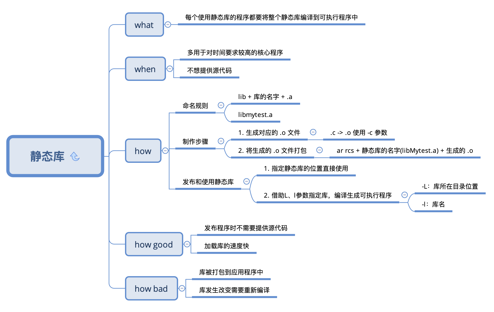
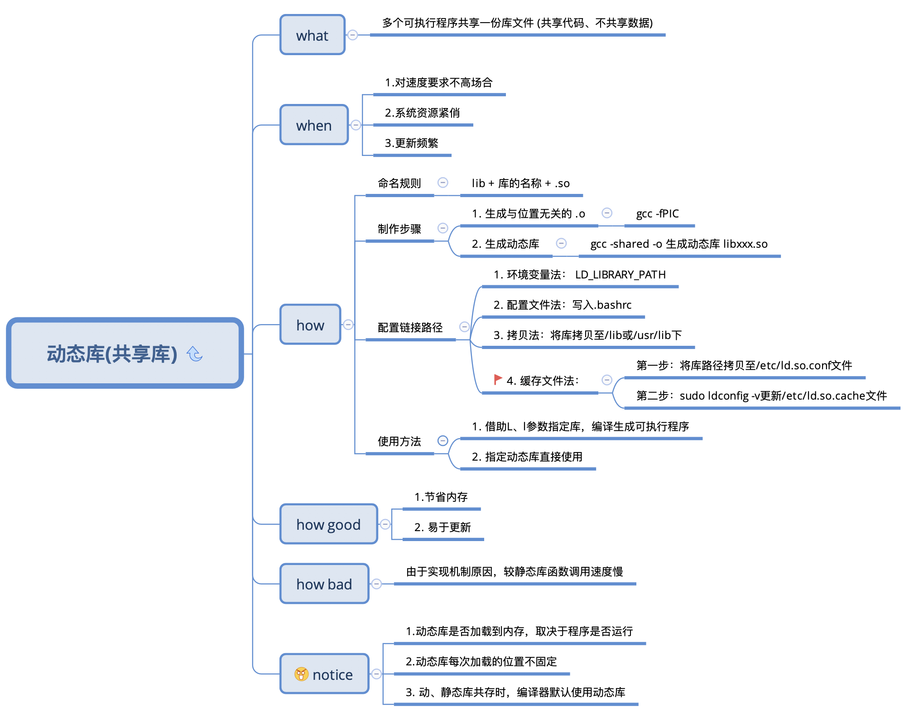

# 静态库、动态库的制作和使用

本文将介绍 C 语言静态库和动态库制作和使用的过程，系统环境是 Ubuntu16.04，其他系统制作方法可能略有差别。

## 目录结构

```
.
├── README.md
├── include
│   └── head.h
├── lib
├── main.c
└── src
    ├── add.c
    ├── mul.c
    ├── sub.c
```

- include - 头文件目录
- lib - 库文件目录
- src - 源代码目录

## 静态库

本节介绍如何将代码编译成静态库。当我们希望程序响应更快，或者不想提供源代码，我们可以使用静态库。



### 编译静态库

```shell
# 将 .c 文件编译成 .o 文件
➜  ls
add.c mul.c sub.c
➜  gcc *.c -c -I ../include
➜  ls
add.c add.o mul.c mul.o sub.c sub.o

# 将 .o 文件打包，生成 .a 文件
➜  ar rcs libMyCalc.a *.o
➜  ls
add.c       libMyCalc.a mul.o       sub.o
add.o       mul.c       sub.c

# 将 .a 文件移动到 lib 目录下
➜  mv libMyCalc.a ../lib
```

### 使用静态库

```shell
# 方式 1
gcc main.c lib/libMyCalc.a -I include -o sum
./sum

# 方式 2
gcc main.c -Iinclude -L lib -l MyCalc -o myapp
./myapp
```


## 动态库



### 编译动态库

```shell
# .c 编译为 .o
➜  src git:(master) ✗ ls
add.c mul.c sub.c
➜  src git:(master) ✗ gcc -fPIC -c *.c -I ../include
➜  src git:(master) ✗ ls
add.c add.o mul.c mul.o sub.c sub.o

# .o 打包为 .so
➜  src git:(master) ✗ gcc -shared -o libMyCalc.so *.o -Iinclude
➜  src git:(master) ✗ ls
add.c        libMyCalc.so mul.o        sub.o
add.o        mul.c        sub.c

# .so 移动到 lib
➜  src git:(master) ✗ mv libMyCalc.so ../lib
```


### 使用动态库

```
# 方式 1
gcc main.c lib/libMyCalc.so -o app -Iinclude
./app

# 方式 2
gcc main.c -Iinclude -L lib -l MyCalc -o myapp
./myapp
```

如果在使用动态库的过程中遇到了问题，请看下一小结。


### 动态库链接失败问题

动态库是由动态连机器加载的，通过`ldd app`我们可以查看可执行文件执行的时候依赖的所有动态库。交由动态连接器管理的动态库都能被正确加载，比如说`/lib`目录下的库文件。我们自定义的动态库没有被加载就是因为没有告知动态连接器我们的动态库在哪里。

### 方法一 临时配置

要想汤动态连机器知道我们的动态库在哪，一种方式是直接把自定义的动态库丢到`/lib`目录下，这样自然就能加载到了，当然我想没有人会想这么做的。另一种方式就是在配置文件中配置动态库的位置，比如像下面的这样：

```
export LD_LIBRARY_PATH=我们的动态库位置
```

`LD_LIBRARY_PATH`我们可以将动态库的位置保存在这里，此时就能顺利运行程序，但是重启终端将会失效，临时测试的时候使用很方便。

### 方法二 永久配置

```
1. vim /etc/ld.so.conf
2. 将动态库的路径配置在里面
3. sudo ldconfig -v
```


