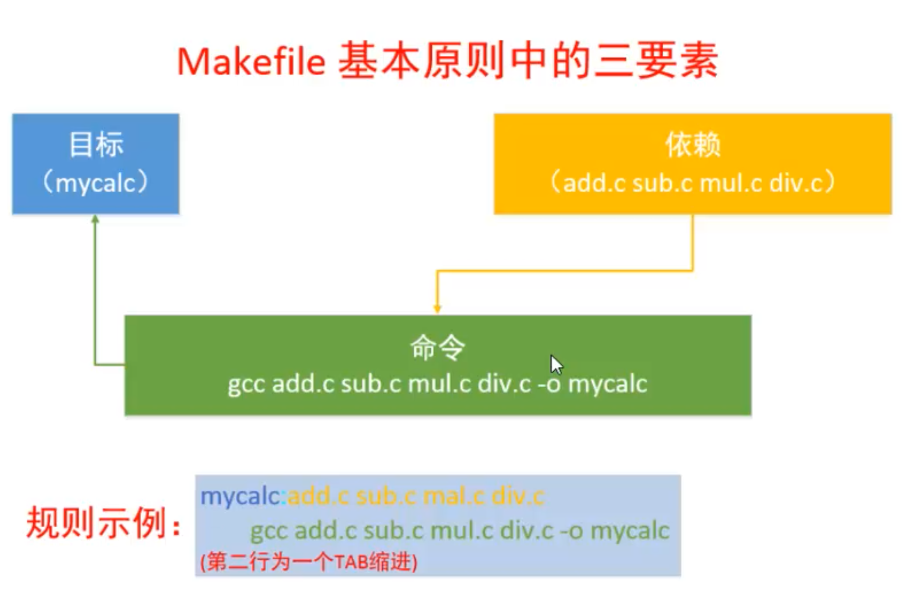
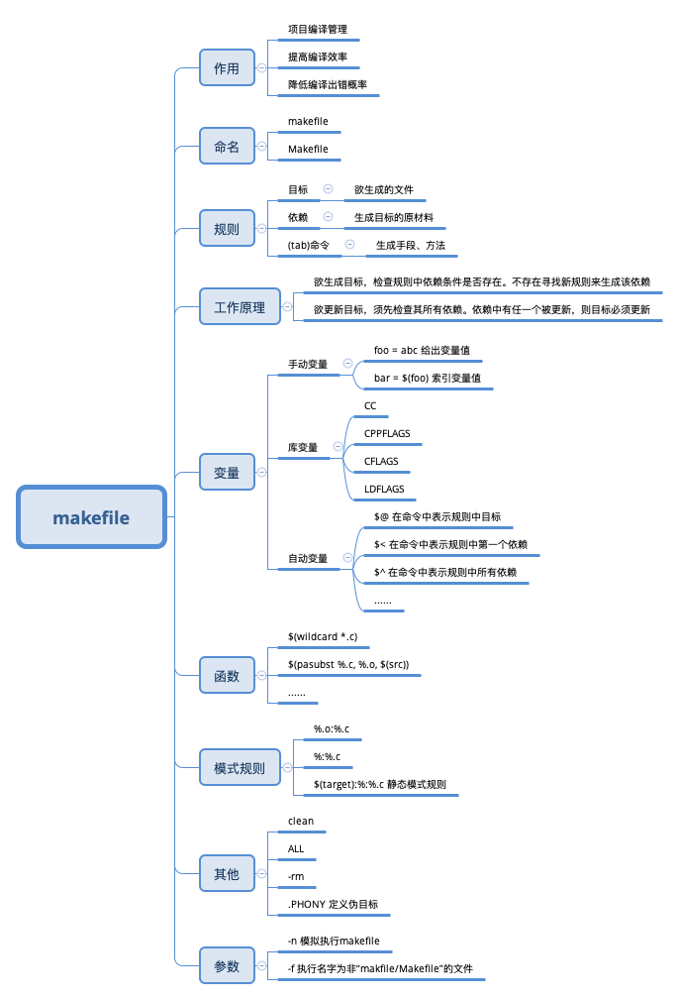

# 最简单的 makefile



```makefile
app: main.c add.c mul.c sub.c
	gcc main.c add.c mul.c sub.c -o app
```

- 目标：生产名为 app 的可执行文件
- 依赖：可执行文件通过 .c 文件生成
- 命令：通过 gcc 命令生成


第一个版本的问题在于每次都需要编译所有的 .c 文件，如果想要修改哪个文件就只编译修改过的文件就可以这样那样写：

```makefile
app:main.o add.o mul.o sub.o
	gcc main.o add.o mul.o sub.o -o app

main.o:main.c
	gcc -c main.c

add.o:add.c
	gcc -c add.c

mul.o:mul.c
	gcc -c mul.c

sub.o:sub.c
	gcc -c sub.c
```

- 目标：生成名为 app 的可执行文件
- 依赖：预编译完成的 .o 文件
- 命令：系列 gcc 命令

# makefile的工作原理



# makefile中的变量


```makefile
obj=main.o add.o mul.o sub.o
target=app
CC=gcc
$(target):$(obj)
    gcc $(obj) -o $(target)
    
%.o:%.c
	$(CC) -c $< -o $@
```

`%.o:%.c `模式匹配

自动变量，只能在规则中的命令中使用

- `$<`规则中第一个依赖
- `$@`规则中的目标
- `$^`规则中所有依赖

# makefile中的函数

```makefile
target=app
src=$(wildcard ./*.c)
obj=$(patsubst ./%.c, ./%.o, $(src))
CC=gcc
CPPFLAGS=-I
$(target):$(obj)
	$(CC) $(obj) -o $(target)
    
%.o:%.c
	$(CC) -c $< -o $@
	
.PHONY:clean
clean:
	rm -f $(obj) $(target)
```